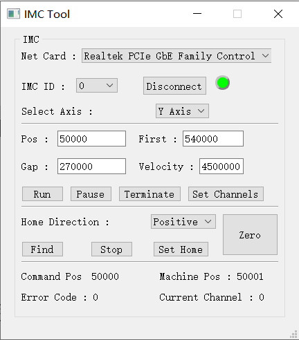

# imc-tool

## Introduce

The motion control card is a 4-axis motion control card based on real-time Ethernet communication. The axis number definition of the control card is  axis 0, axis 1, axis 2, axis 3. And the imc-tool is a helpful tool for controlling the imc304 device, you can use it for automation purpose.

## Feature

- support ethernet connection
- x axis control
- y axis control
- find home 

## Build

environment

- Windows10
- Qt5.12.9 MSVC2017 64

## Param

- Net Card：The NIC device connected to the motor card

- IMC ID：Set the virtual ID of the IMC NIC device, which is 0 by default

- Connect Motor：Connect the motor button

- Select Axis：The currently controlled motor axis, the x-axis is the axis above the turntable, and the y-axis is the lower spindle

- Pos：Controls the absolute position in the number of pulses

- First：Start angle position, in the number of pulses

- Gap：The offset between each corner, in the number of pulses

- Velocity：The speed of the motor

- Run：The motor turns

- Pause：The motor is suspended

- Terminate：Stops the current rotation

- Set Channels：Demonstration of motor angle rotation

- Home Direction：Positive represents a positive turn, and Negative represents a reversal

- Find：Click to start finding the origin (zero)

- Stop：Stop looking for the zero point

- Set Home：Sets the current position to zero

- Command Pos：Command position

- Machine Pos：The current machine rotation position

- Error Code：The error code of current control system

## Use

1. Select the right `Net Card` && `IMC ID`,
2. Click the button `Connect Motor`, the light will turn green if successful
3. Select the axis you want to control
4. Click `Run` then you can control the machine